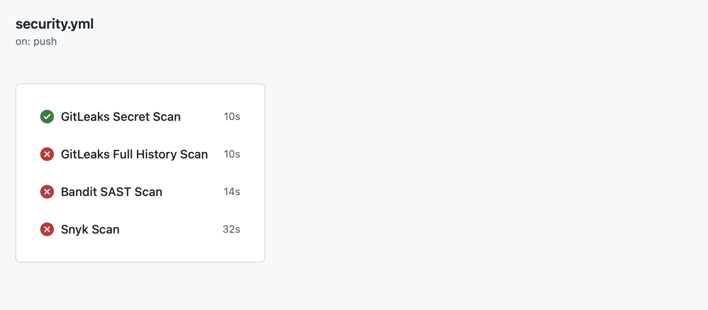
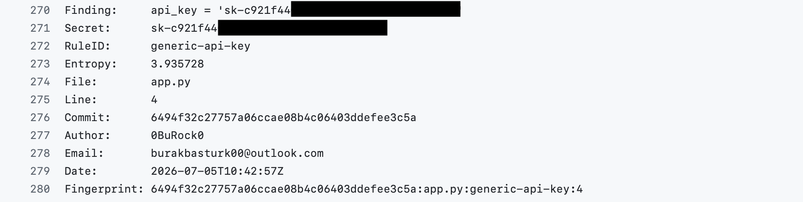
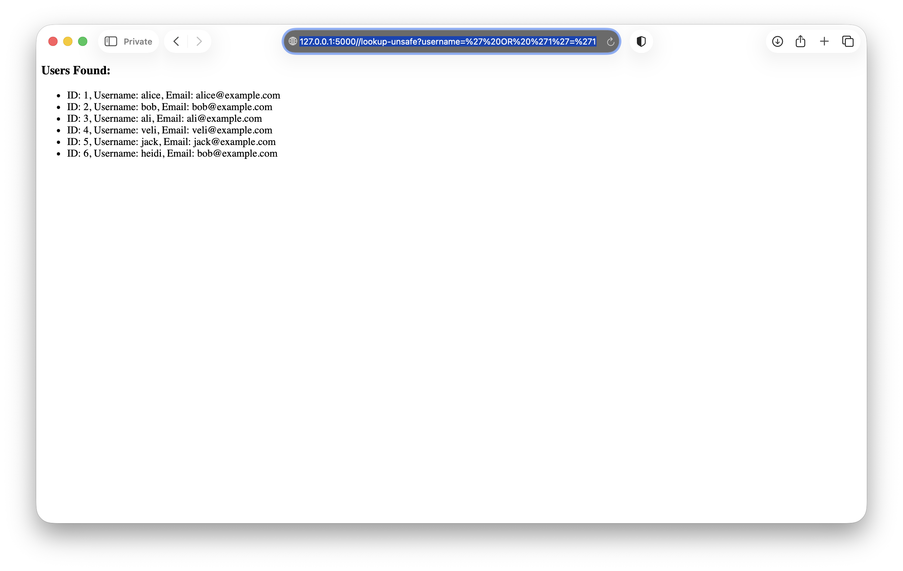
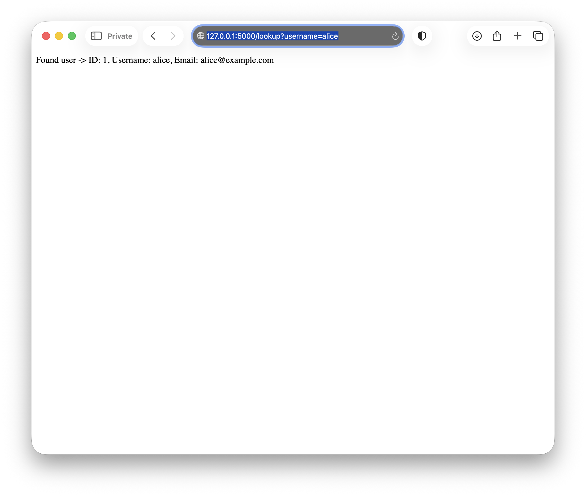
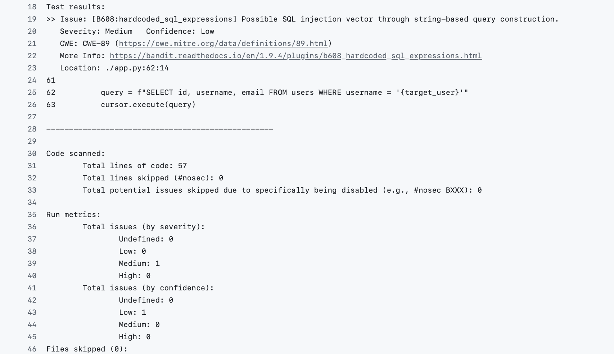
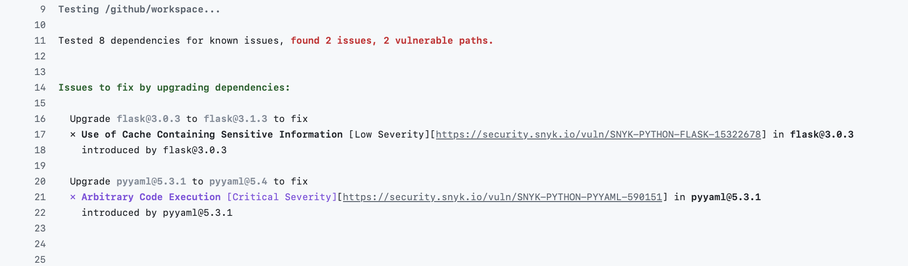

# DevSecOps-Pipeline-Demo

A DevSecOps pipeline demo: a deliberately vulnerable app scanned by GitLeaks, Bandit, and Snyk to demonstrate how automated security scanning fits into a real CI/CD workflow.

## Overview / Purpose

This project demonstrates a basic DevSecOps pipeline to understand how vulnerability scanning works in an actual project, not just in theory.

Tools used and their category:

| Tool | Category |
|---|---|
| GitLeaks | Secret scanning |
| Bandit | SAST (Static Application Security Testing) |
| Snyk | SCA (Software Composition Analysis) |

## Architecture / Pipeline

- **Trigger:** the pipeline runs on every push.
- **Jobs:** `secret-scan`, `secret-scan-full-history`, `bandit-scan`, `snyk-scan`. All four are separate jobs in the same workflow file with no `needs:` dependency between them, so GitHub Actions runs them in parallel by default.

| Job | What it does |
|---|---|
| `secret-scan` | Uses GitLeaks to scan the commits included in the current push, checking for secrets (API keys, credentials, etc.) being committed to git. |
| `secret-scan-full-history` | Same tool as `secret-scan`, but scans the entire git history instead of just the current push, to catch anything left behind or forgotten. |
| `bandit-scan` | Uses Bandit to scan the app's source code for known code-level vulnerabilities. |
| `snyk-scan` | Uses Snyk to scan the app's dependencies for known vulnerabilities. |

## The Vulnerable App

| Flaw | Why it's dangerous | How it's fixed |
|---|---|---|
| **SQL injection** | Can lead to data leaks and other serious issues. Attackers can manipulate query logic through unsanitized string inputs to bypass checks or extract data they shouldn't have access to — extra care is needed around any user input, especially strings used directly in queries. | Use parameterized queries / an ORM instead of building SQL strings from raw input. |
| **Hardcoded API key** | Can be found in the git log or exposed on the frontend. If leaked, an attacker can use the key under your account, potentially causing real financial damage. | Use environment variables (`.env` files) and make sure they're excluded from version control (`.gitignore`). |
| **Vulnerable dependency (PyYAML)** | Even a project with flawless first-party code isn't safe from this — if a dependency is compromised, your project is compromised too, regardless of how carefully you wrote your own code. | Keep dependencies updated and scan them regularly (this is what `snyk-scan` is for). |

## Findings

- [x] **GitLeaks (push-scoped)**

  In the first run, the GitLeaks job caught the hardcoded API key and flagged it. Later, after adding the Bandit job, GitLeaks stopped flagging anything — even though the key was still sitting in the git history. Digging into this, I found that GitLeaks' default scan is scoped to the current push, not the full repository history — since I'd only modified and committed the workflow file at that point, the push didn't include the commit with the key, so there was nothing in that specific push for GitLeaks to catch. This led me to add a second job that runs GitLeaks against the entire git history instead.

  
  *On a later push, the standard scan passes (no secret in the latest commit), but the full-history scan still fails.*

  
  *Inside the full-history job, GitLeaks shows exactly which commit introduced the secret and what the leaked value was.*

- [x] **Bandit**

  

  
  *The app is vulnerable to SQL injection, demonstrated here.*

  
  *Bandit reports the exact location of the issue, its severity and confidence level, and the corresponding CWE code.*

- [x] **Snyk**

  
  *Snyk flags the pinned vulnerable dependency (`PyYAML==5.3.1`) with an upgrade suggestion. It also unexpectedly caught a vulnerability in the Flask version used to build the app — a good reminder that these issues can surface anywhere, at any time, which is exactly why dependency scanning needs to run on every change, not just once. A CI job makes that easy to enforce automatically.*

## The GitLeaks Scope Discovery

- **What I observed:** I initially assumed the GitLeaks job would re-flag the hardcoded key on every run. It didn't.
- **What I tested/confirmed:** I added a second job to the workflow that scans full git history instead of just the current push, and confirmed it still catches the key that the standard job had stopped flagging. This is what led me to actually understand how GitLeaks' default scanning behaves, rather than just assuming it worked a certain way.
- **What this means practically:** the standard, push-scoped scan is a fast check limited to the latest push — good for catching *new* secrets as they're introduced. The full-history scan is slower but far more thorough, and is what you'd rely on to confirm nothing was missed. In production, these serve different purposes: CI-triggered scanning catches new secrets going in; it does not continuously re-audit old history.

## What I'd Do Differently in Production

- I'd run the full-history audit periodically rather than on every push — similar to a routine end-of-shift check to confirm nothing slipped through, rather than a scan that runs (and costs time) on every single commit.
- Other additions I'd consider: branch protection rules that require these status checks to pass before merging to `main`, and requiring PR review before merge so a second person can catch anything the automated scans miss.

## Reflection / What I Learned

Working through this project taught me how a real security pipeline is structured — which type of tool belongs where, and why. The most valuable lesson was the GitLeaks scope issue: there's a real difference between *using* a tool and actually *understanding* how it behaves by default.

If I were describing this project to an interviewer: this was a small, focused look at a DevSecOps pipeline, but the debugging process along the way — a naming mismatch on the Snyk token, a workflow typo, and discovering GitLeaks' scan-scope limitation firsthand — taught me more than the initial setup itself. It was a simple project to build, but a genuinely valuable one to have built.

## How to Run It Yourself

1. Clone the repository.
2. Sign up for a free [Snyk](https://snyk.io) account and generate a personal API token.
3. In your repo, go to **Settings → Secrets and variables → Actions** and add a new secret named `SNYK_TOKEN` with that value.
4. Push to any branch — the pipeline runs automatically on push and all four jobs will execute in parallel.
